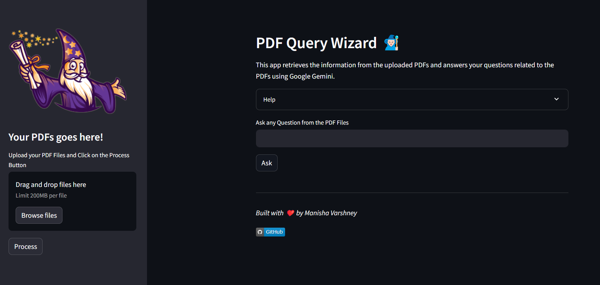
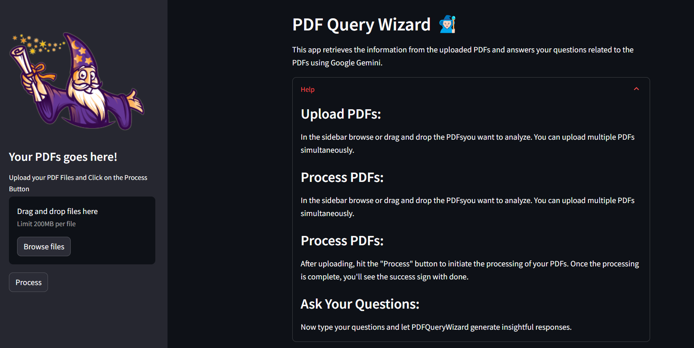
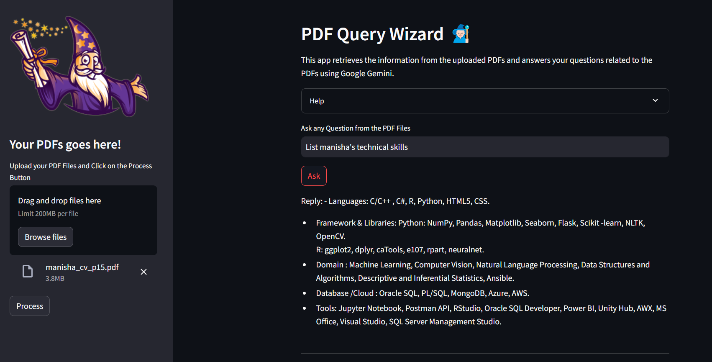

# PDF Query Wizard

Welcome to PDFQueryWizard, a dynamic application powered by Python Streamlit, utilizing Google Gemini for advanced document analysis. This tool empowers you to effortlessly upload and process multiple PDF documents, enabling you to pose questions and receive insightful answers.


---


## Features:

- **Upload Multiple PDFs:** Easily upload and submit multiple PDF documents at once.

- **Effortless Processing:** Press the "Process" button to initiate seamless processing with the advanced capabilities of Google Gemini.

- **Ask Questions:** Post-processing, enter your questions, and watch as PDFQueryWizard utilizes Google Gemini to generate accurate and relevant answers.

- **Workflow:**
  1. **Text Extraction:** PDFs are processed to extract raw text for all documents.
  2. **Chunking:** Raw text is segmented into chunks for efficient analysis.
  3. **Vectorization:** FAISS is employed to find vectors for these text chunks, enhancing processing speed.
  4. **Vector Storage:** Vectors are saved for future use, optimizing response time.


---


## Getting Started:

1. **Upload PDFs:**
   - Click on the "Upload" button to select and upload the PDFs you want to analyze.
   - Multiple PDFs can be uploaded simultaneously.

2. **Process PDFs:**
   - After uploading, hit the "Submit" button to leverage the power of Google Gemini for processing your PDFs.

3. **Ask Your Questions:**
   - Once processing is complete, enter your queries.
   - PDFQueryWizard, backed by Google Gemini, will provide detailed and insightful responses.

4. **Explore Results:**
   - View the answers generated by the system based on the content of your uploaded PDFs.


---


## Tech Stack:

PDFQueryWizard integrates Python Streamlit for a user-friendly interface, Google Gemini for question answering, and FAISS for efficient vectorization and storage.


---


## Installation:

To run PDFQueryWizard locally, follow these steps:

1. Clone the repository:
   ```bash
   git clone https://github.com/manisha-v/PDF-Query-Wizard.git
   ```

2. Navigate to the project directory:
   ```bash
   cd PDF-Query-Wizard
   ```

3. Install dependencies:
   ```bash
   pip install -r requirements.txt
   ```

4. Run the application:
   ```bash
   streamlit run app.py
   ```

Visit `http://localhost:8501` in your web browser to start using PDFQueryWizard with Google Gemini.


---


## Deployment:

PDFQueryWizard is deployed and accessible. Visit [Your Deployment Link] to experience the tool online.


---


## Preview Images:


Home page


Help


upload PDFs and ask your query


---


## Contact

I'm always open to new opportunities and collaborations. Feel free to reach out to me through the contact form on my [portfolio website](https://manisha-v.github.io/portfolio/) or via email at [varshney.manisha05@gmail.com](mailto:varshney.manisha05@gmailcom).

Connect me on [LinkedIn](https://www.linkedin.com/in/manisha-varshney-914646191/)  